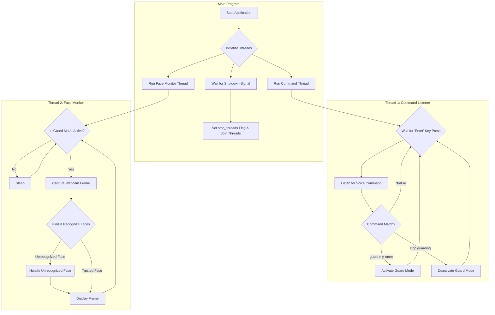

# 🛡️ AI Guard Agent 
**An AI-Powered Room Monitoring System using Voice Control, Face Recognition, and Conversational AI**

> *Developed for the course EE782: Advanced Topics in Machine Learning (IIT Bombay)*

---

## 🎯 Overview

**AI Guard Agent** is an intelligent, voice-activated security system that uses **machine learning, computer vision**, and **large language models** to monitor a room in real-time.
It recognizes **trusted individuals** and issues **AI-generated spoken warnings** to **unrecognized persons** that escalate in tone and urgency if they remain.

---

## ✨ Core Features

| Feature | Description |
|----------|-------------|
| 🎙️ **Voice-Controlled Activation** | The agent activates or deactivates monitoring via spoken commands: `"activate protection"` and `"deactivate"`. |
| 👁️ **Real-Time Face Recognition** | Uses OpenCV + `face_recognition` to identify trusted individuals and detect unknown visitors. |
| 🧠 **Dynamic Conversational AI** | Integrates **Google Gemini LLM** to generate context-aware spoken dialogues for unrecognized persons. |
| ⚠️ **Escalating Response System** | The AI becomes progressively firmer if the intruder remains detected. |
| 🔀 **Multi-Threaded Design** | Uses threads for voice commands, video monitoring, and memory cleanup to ensure smooth performance. |
| 🔐 **Secure API Management** | Keeps sensitive API keys safe in a `.env` file. |

---

## 🧩 System Architecture

The application uses **three concurrent threads** to perform continuous monitoring and user interaction without blocking.

### 🧵 Parallel Threads
1. **Command Listener** – waits for user input and activates/deactivates guard mode.
2. **Face Monitor** – captures webcam feed and detects/recognizes faces.
3. **Memory Cleaner** – clears expired face data periodically (every 5 minutes).

### 🔁 Flow Diagram



---

## ⚙️ Setup and Installation

### 🧱 Prerequisites
- **Python 3.8+**
- **Working webcam and microphone**
- **Git**
- **CMake** and **dlib** (required for `face_recognition`)

---

### 🪜 Step 1: Clone the Repository
```bash
git clone https://github.com/your-username/AI-Guard-Agent.git
cd AI-Guard-Agent
```

---

### 🪜 Step 2: Create a Virtual Environment
**Windows:**
```bash
python -m venv venv
venv\Scripts\activate
```
**macOS/Linux:**
```bash
python3 -m venv venv
source venv/bin/activate
```

---

### 🪜 Step 3: Install Dependencies
```bash
pip install -r requirements.txt
```
> **Note:** You may need to install system dependencies for `dlib` (like `cmake`, `boost`, and Visual Studio Build Tools on Windows).

---

### 🪜 Step 4: Configure the Gemini API Key
1. Obtain your Gemini API key from [Google AI Studio](https://aistudio.google.com/app/apikey).
2. In the project root, create a file named `.env` and add:
   ```
   GEMINI_API_KEY="YOUR_API_KEY_HERE"
   ```

---

## 🧍‍♂️ How to Use

### 🔹 Step 1: Enroll Trusted Faces
Create a folder for trusted individuals and generate encodings.

```bash
python enroll_faces.py
```
> This creates an `encodings.pkl` file containing all known faces.

### 🔹 Step 2: Run the AI Guard
```bash
python ai_guard.py
```

### 🎤 Voice Commands
- **"guard my room"** → Activates guard mode
- **"stop guarding"** → Deactivates guard mode

Press **`Q`** to quit at any time.

---

## 📺 Demo Video

🎥 **Demo Video (2–3 mins)** – [Insert your YouTube or Google Drive link here]  
💻 **Code Walkthrough (5 mins)** – [Insert your video walkthrough link here]

---

## 🧠 Technologies Used
- **Python**
- **OpenCV** – for video frame capture
- **face_recognition** – for facial detection and encoding
- **SpeechRecognition** – for voice command recognition
- **gTTS** + **playsound** – for text-to-speech conversion
- **Google Gemini API** – for dynamic dialogue generation
- **threading** – for concurrent task execution

---

## 🧹 File Structure

```
AI-Guard-Agent/
│
├── ai_guard.py              # Main agent logic
├── enroll_faces.py          # Script to enroll trusted faces
├── encodings.pkl            # Generated facial encodings
├── trusted_faces/           # Folder with enrolled face images
├── .env                     # API key (not tracked in Git)
├── requirements.txt         # Python dependencies
└── README.md                # Project documentation
```

---

## 🧾 Example Escalation Levels

| Level | Time Active (s) | AI Response Type |
|-------|------------------|------------------|
| 1️⃣ | 5 sec | Polite inquiry: “Who are you? What is your purpose here?” |
| 2️⃣ | 15 sec | Firm warning: “This is a restricted area. Please leave immediately.” |
| 3️⃣ | 30 sec | Final alert: “Security protocols initiating. Authorities will be contacted.” |

---

## 🧩 Authors

**Yash Bhongade**  
Indian Institute of Technology, Bombay

